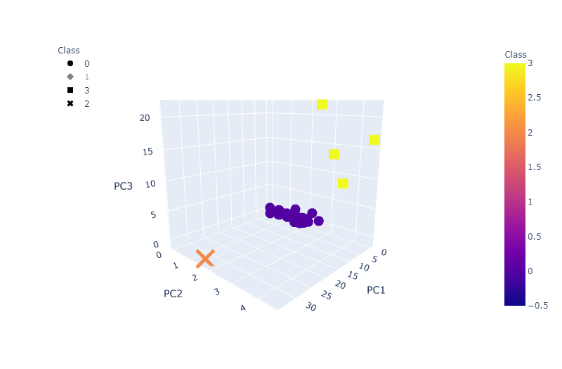
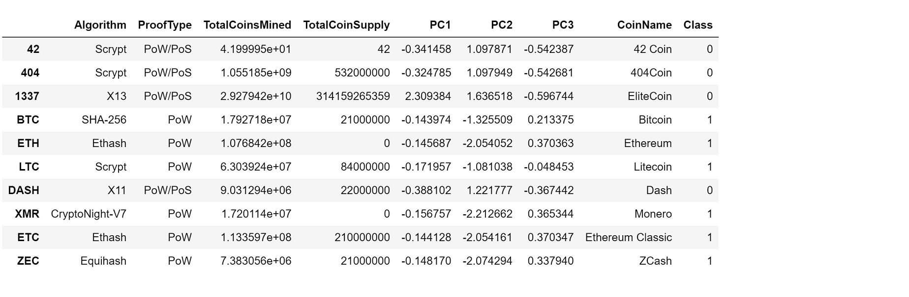
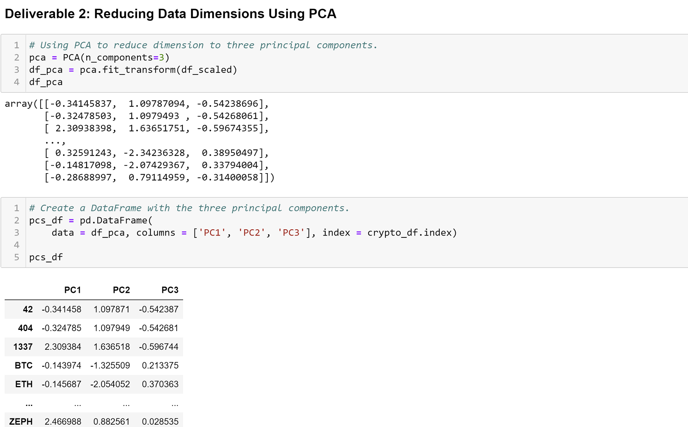
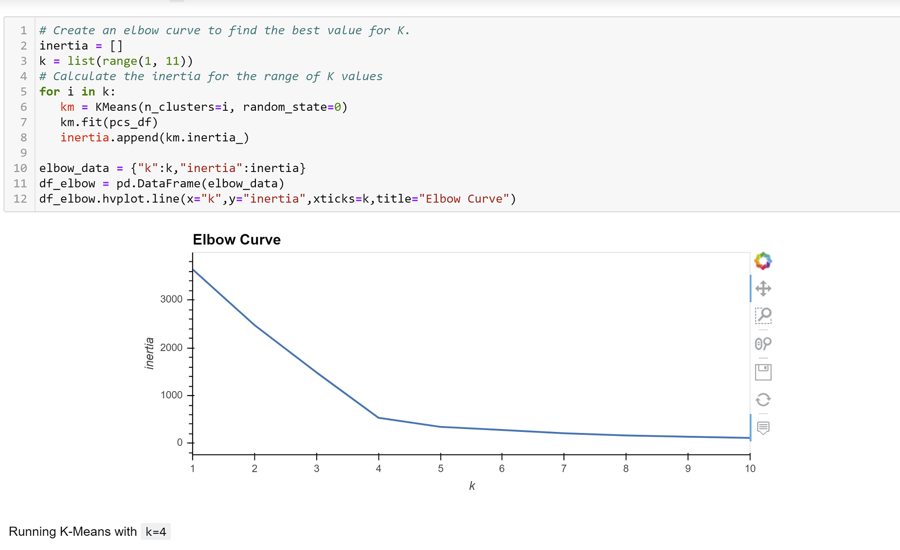
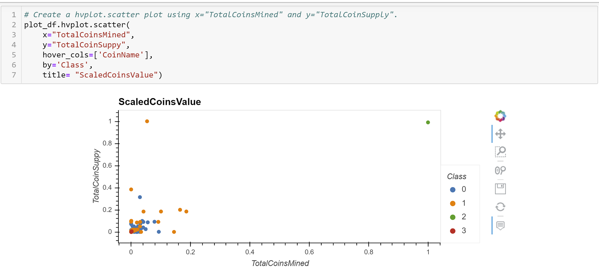

# Cryptocurrencies
## Overview of the Project
In this project I am working with Martha, a senior manager for the Advisory Services Team at Accountability Accounting, one of my most important clients. Accountability Accounting, a prominent investment bank, is interested in offering a new cryptocurrency investment portfolio for its customers. The company, however, is lost in the vast universe of cryptocurrencies. So, they’ve asked me to create a report that includes the cryptocurrencies currently on the trading market and how they could be grouped to create a classification system for the new investment.

The data Martha and I will be working with is not ideal, so it will need to be processed to fit the machine learning models. Since there is no known output for what we are looking for, it is decided to use unsupervised learning. To group the cryptocurrencies, we decided on a clustering algorithm. We’ll use data visualizations to share relevant findings with the board of Accountability Accounting.

## Results: Created Four Deliverables
 Deliverable 1: Process the Data for PCA

 
 Deliverable 2: Reducing Data Dimensions Using PCA

 
 Deliverable 3: Clustering Cryptocurrencies Using K-means

 
 Deliverable 4: Visualizing Cryptocurrencies Results

